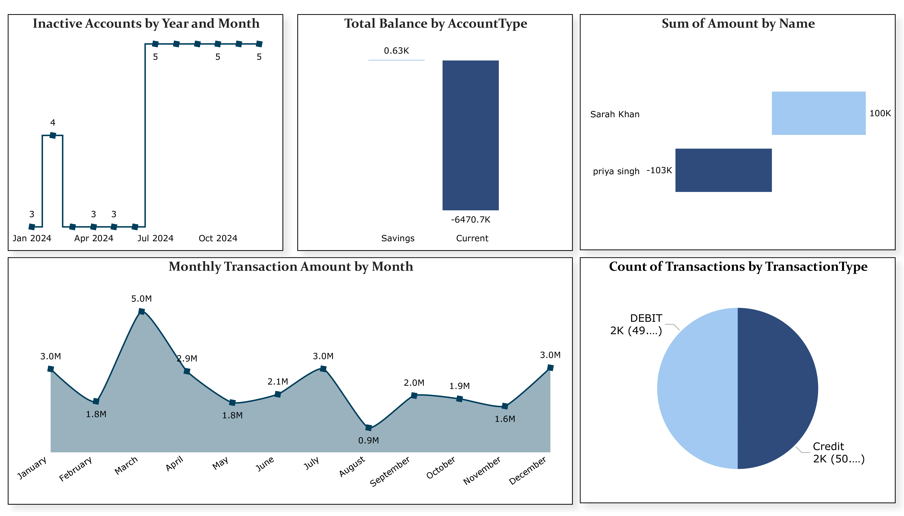
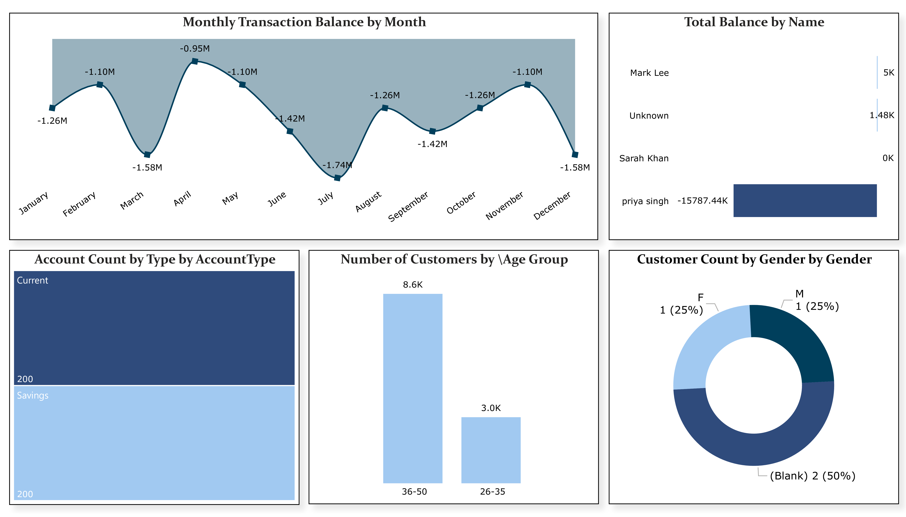

# 💳 Power BI Banking Analytics Dashboard

This project showcases an end-to-end workflow of creating a banking analytics dashboard using synthetic data, SQL Server, and Power BI. It demonstrates data generation, transformation, and visualization to gain meaningful insights from customer and transaction data.

---

## 🧠 Project Summary

1. 📊 **Data Generation**
   - Created a synthetic banking dataset using **Perplexity AI**, including:
     - Customer details
     - Account information
     - Transaction records

2. 🛠️ **Data Preparation (SQL Server)**
   - Standardized all date formats (`DateOfBirth`, `OpenDate`, `TransactionDate`) to `MM/DD/YYYY`.
   - Joined `Customers`, `Accounts`, and `Transactions` tables into a single combined table: `CombinedBankingDataset`.

3. 🚀 **Power BI Dashboard Creation**
   - Imported the final dataset into Power BI.
   - Built KPIs and visuals to track:
     - Total transaction volume
     - Active customers
     - Account type distribution
     - Gender-based financial behavior
   - Refer to screenshots below for KPI insights 📷

4. 🧹 **Power Query Data Cleaning**
   - Replaced all `NULL` values with `"Unknown"`.
   - Converted data types (e.g., date, currency).
   - Created DAX measures to enhance analysis and interactivity.

---

## 📎 Live Dashboard Link

🔗 [Click to View on Power BI](https://app.powerbi.com/links/M_v6O-O80Z?ctid=6d600138-0932-49bd-951c-0d8382b1ee74&pbi_source=linkShare&bookmarkGuid=3448b23d-8c5d-474d-8f10-312617cc463a)

---

## 🖼️ Dashboard Previews

### 🔹 Page 1: Overview & Key Metrics

---

### 🔹 Page 2: Customer & Account Insights

---

## 🧰 Tools & Technologies Used

- **SQL Server** for data preprocessing and table joins
- **Power BI Desktop** for interactive dashboard development
- **Power Query** for cleaning and data shaping
- **DAX** for calculated measures and KPIs
- **Perplexity AI** for synthetic dataset generation

---

---

## 🙌 Acknowledgements

Thanks to **Perplexity AI** for helping generate realistic sample data and **Power BI Community** for guidance on DAX and Power Query best practices.

---

